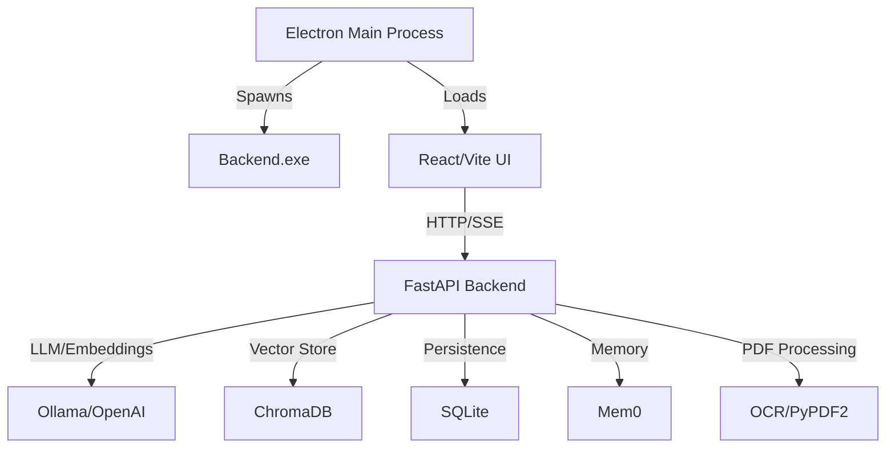

# AI Agent Instructions for ElectronAIChat

## Architecture Overview

Desktop RAG (Retrieval-Augmented Generation) application with Electron/TypeScript frontend and Python/FastAPI backend.

### Component Architecture


**Tech Stack:**
- Frontend: Electron 26, TypeScript, React 19, Vite, TailwindCSS 4
- Backend: FastAPI, ChromaDB, SQLite (SQLModel), Mem0, LangChain, Ollama/OpenAI
- Build: PyInstaller (backend), electron-builder (packaging)

## Critical Development Workflows

### Development Mode
```bash
# Terminal 1: Start backend (Python)
cd backend
python main.py  # FastAPI on http://127.0.0.1:8000

# Terminal 2: Start Electron + React dev server
cd electron
npm run start  # Vite on http://localhost:5173, Electron watches
```

**Key**: Dev mode expects backend running separately. Electron's `main.ts` loads `http://localhost:5173` when not packaged.

### Production Build (Critical!)
```bash
# 1. Build backend executable with PyInstaller
cd backend
pyinstaller backend.spec  # Creates dist/backend.exe

# 2. Package Electron app (automatically copies backend.exe)
cd electron
npm run prepackage  # Copies backend.exe to electron/dist/
npm run package     # electron-builder creates installer
```

**Build Pattern**: `prePackage.js` script checks for `backend.exe`, builds if missing using `backend.spec`, then copies to `electron/dist/` for packaging.

### Backend Lifecycle Management
```typescript
// electron/main.ts - Electron manages backend subprocess
startBackend()  // Spawns backend.exe, hidden console window
waitForHealth("http://127.0.0.1:8000/api/status", 30000)  // Polls until ready (30s timeout)
stopBackend()  // Uses taskkill /IM backend.exe /T /F to cleanup
```

**Critical**: Backend runs as subprocess. `before-quit` hook kills all backend.exe instances to prevent orphaned processes. Extended timeout (30s) accounts for first-time database initialization and model loading.

## Key Patterns and Conventions

### Dependency Injection Pattern (FastAPI)
```python
# backend/main.py - Initialize once, inject everywhere
langchain_manager = LangChainEmbeddingManager(provider=PROVIDER)
mem0_manager = Mem0MemoryManager()
openai_client = EnhancedOpenAIClient(...)
dependencies.set_managers(langchain_manager, mem0_manager, openai_client)

# app/routes/dependencies.py - Centralized DI
_langchain_manager: LangChainEmbeddingManager = None  # Module-level global
def get_langchain_manager(): return _langchain_manager
LangChainManager = Annotated[LangChainEmbeddingManager, Depends(get_langchain_manager)]

# app/routes/documents.py - Use type aliases for clean injection
async def upload_document(
    langchain_manager: LangChainManager = None,
    mem0_manager: Mem0Manager = None,
    session: DBSession = None
):
```

**Pattern**: Single global instance per manager, initialized in `main.py` via `set_managers()`, accessed via FastAPI `Depends()`. Uses type aliases (`LangChainManager`, `Mem0Manager`) for cleaner signatures.

### API Communication Pattern
```typescript
// Frontend: EventSource for streaming chat responses
apiClient.streamResponse('/api/chat/stream', payload, onChunk, onError)

// Backend: FastAPI StreamingResponse with SSE format
async def generate():
    yield f"data: {json.dumps({'token': token, 'done': False})}\n\n"
    # Final message:
    yield f"data: {json.dumps({'token': '', 'done': True})}\n\n"
```

**Streaming Protocol**: Server-Sent Events (SSE) with `text/event-stream`, JSON-encoded chunks containing `token` and `done` flag. Frontend creates AI message before stream starts, updates progressively as tokens arrive.

#### Complete Streaming Flow (End-to-End)

**1. Frontend Initiates Stream** (`useChat.ts`):
```typescript
// Pre-allocate message ID before stream starts
const aiMessageId = (Date.now() + 1).toString();
let fullResponse = '';

apiClient.streamResponse('/api/chat/stream', payload, 
  (chunk) => {
    // Progressive update: Accumulate tokens
    fullResponse += chunk.token || '';
    
    // Create message on first token
    if (!aiMessageAdded && fullResponse.trim()) {
      const aiMessage = { id: aiMessageId, role: 'assistant', content: fullResponse };
      onStreamUpdate?.(chatId, aiMessage, false); // isDone=false
      aiMessageAdded = true;
    } else if (aiMessageAdded) {
      // Update existing message with accumulated content
      onStreamUpdate?.(chatId, { ...aiMessage, content: fullResponse }, false);
    }
  },
  (error) => {
    // Error handling: Update same message with error content
    onStreamUpdate?.(chatId, { id: aiMessageId, content: `Error: ${error.message}` }, true);
  },
  () => {
    // Completion: Signal stream done without creating new message
    onStreamUpdate?.(chatId, { id: aiMessageId }, true); // isDone=true
  }
);
```

**2. Backend Generates Stream** (`chat.py`):
```python
async def generate():
    # Save user message to SQLite BEFORE streaming
    user_message = Message(chat_id=chatId, role="user", content=message)
    session.add(user_message)
    session.commit()
    
    # Retrieve RAG context (if searchMode="embeddings")
    doc_context = await langchain_manager.search_documents(chat_id, query, k=3)
    
    # Retrieve Mem0 context (if useMemory=True)
    memories = mem0_manager.search_memory(user_id, query, limit=5)
    mem0_context = "\n".join([m['memory'] for m in memories['results']])
    
    # Build conversation with context injection
    messages = [
        {"role": "system", "content": f"{systemPrompt}\n{doc_context}\n{mem0_context}"},
        {"role": "user", "content": message}
    ]
    
    # Stream from LLM
    stream = openai_client.chat_stream(messages, model, temperature, max_tokens)
    for chunk in stream:
        token = chunk.choices[0].delta.content or ""
        yield f"data: {json.dumps({'token': token, 'done': False})}\n\n"
    
    # Final SSE event
    yield f"data: {json.dumps({'token': '', 'done': True})}\n\n"
    
    # Save assistant response to SQLite AFTER streaming
    assistant_message = Message(chat_id=chatId, role="assistant", content=full_response)
    session.add(assistant_message)
    
    # Store in Mem0 for long-term memory (async, non-blocking)
    mem0_manager.add_message(user_id, message, role="user")
    mem0_manager.add_message(user_id, full_response, role="assistant")
```

**Critical Pattern**: 
- **Single Message Update**: Frontend creates ONE AI message ID, updates its content progressively (no new messages per token)
- **Error Resilience**: If stream fails, same message ID shows error content
- **SQLite Persistence**: User message saved BEFORE stream, assistant message saved AFTER stream completes
- **Context Injection**: RAG and Mem0 contexts injected into system prompt, not as separate messages

### Mem0 Memory System Usage Patterns

**Architecture** (`memory.py`):
- Uses ChromaDB for vector storage (collection: `mem0_memory` in `{BASE_DIR}/chroma_db/mem0/`)
- Deduplicates facts automatically (returns empty results for known information)
- Gracefully falls back to `MemoryStub` if initialization fails

#### Memory Lifecycle

**1. Automatic Storage After Chat** (`chat.py`):
```python
# After streaming completes
await run_in_threadpool(
    mem0_manager.add_message,
    user_id=payload.userId,
    message=payload.message,
    role="user",
    metadata={"chatId": payload.chatId}
)

await run_in_threadpool(
    mem0_manager.add_message,
    user_id=payload.userId,
    message=full_response,
    role="assistant",
    metadata={"chatId": payload.chatId}
)
```

**2. Memory Retrieval Before Response** (`chat.py`):
```python
# Retrieve relevant memories based on current query
relevant_memories = mem0_manager.search_memory(
    user_id=payload.userId,
    query=payload.message,
    limit=5
)

# Extract memory strings from results wrapper
memories_list = relevant_memories.get("results", [])
if memories_list:
    mem0_context = "\n\n--- User Memory Context ---\n"
    for mem in memories_list:
        mem0_context += f"- {mem['memory']}\n"
```

**3. Mem0 Provider Configuration** (`memory.py`):
```python
config = {
    "vector_store": {
        "provider": "chroma",
        "config": {
            "collection_name": "mem0_memory",
            "path": str(CHROMA_DIR / "mem0")
        }
    },
    "llm": {
        "provider": "ollama" if PROVIDER == "ollama" else "openai",
        "config": {
            "model": DEFAULT_OLLAMA_LLM_MODEL,  # or DEFAULT_OPENAI_LLM_MODEL
            "temperature": 0.1,  # Low temp for factual extraction
            "max_tokens": 2000,
            "ollama_base_url": OLLAMA_HOST  # Note: ollama_base_url, not base_url
        }
    },
    "embedder": {
        "provider": "ollama",  # Matches LLM provider
        "config": {
            "model": "nomic-embed-text",
            "ollama_base_url": OLLAMA_HOST
        }
    }
}
memory = Memory.from_config(config)
```

#### Memory Deduplication Behavior

**Expected `ValueError`** - Mem0 raises `ValueError` when facts are already known:
```python
try:
    result = self.memory.add(messages=[{"role": role, "content": message}], user_id=user_id)
except ValueError as e:
    # "empty embeddings" = mem0 determined all facts already stored
    if "empty" in str(e).lower():
        logger.debug("mem0 skipped storage (duplicate/NOOP)")
        return None
```

**Key Insight**: Empty `results` in response means Mem0 analyzed content but found no NEW facts to store. This is normal and prevents memory bloat.

#### Memory Search Results Format

```python
# Mem0 returns wrapper dict with 'results' list
{
    "results": [
        {
            "memory": "User prefers Python for backend development",
            "metadata": {"chatId": "abc123", "timestamp": "2025-11-19T..."}
        },
        {
            "memory": "User is building an Electron desktop app",
            "metadata": {"chatId": "abc123"}
        }
    ]
}
```

**Access Pattern**:
```python
memories = mem0_manager.search_memory(user_id, query, limit=5)
memories_list = memories.get("results", []) if isinstance(memories, dict) else memories

for mem in memories_list:
    print(mem["memory"])  # Extracted fact summary
```

#### MemoryStub Fallback Behavior

If `mem0ai` package unavailable or initialization fails:
- **Naive In-Memory Store**: Keeps last N messages per user (no deduplication)
- **No Persistence**: Lost on backend restart
- **Development Use Only**: Install `mem0ai` for production

```python
# MemoryStub simplified search
def search(self, query: str, user_id: str, limit: int = 5):
    all_for_user = self._store.get(user_id, [])
    # Returns last `limit` messages (no semantic search)
    return [{"memory": "...", "metadata": {}} for item in all_for_user[-limit:]]
```

### RAG Implementation Details

**Document Processing Pipeline:**
1. Upload via `/documents/upload` → temp file in `UPLOAD_DIR`
2. Extract text: PyPDF2 first, OCR fallback if empty, JSON parsing for `.json`
3. Split with LangChain `RecursiveCharacterTextSplitter` (500 chars, 50 overlap)
4. Embed via LangChain (Ollama `nomic-embed-text` or OpenAI `text-embedding-3-small`)
5. Store in ChromaDB with metadata: `chatId`, `userId`, `filename`, `timestamp`
6. **Security**: Delete temp file after processing to prevent disk accumulation

**Query Flow:**
```python
# embeddings.py - LangChainEmbeddingManager.query_documents()
vectorstore = Chroma(persist_directory=str(collection_path), ...)
results = vectorstore.similarity_search(query, k=top_k, filter=metadata_filter)
```

**Key Detail**: ChromaDB auto-persists to disk in `CHROMA_DIR/{chatId}/`. Filters by `chatId` for chat-scoped retrieval. Returns LangChain `Document` objects with `page_content` and `metadata`.

### Data Persistence Architecture

**Platform-Specific Storage** (`app/config.py`):
```python
# Automatically uses AppData on Windows when packaged
USE_APP_DATA_DIR = IS_PACKAGED or os.getenv("USE_APP_DATA_DIR") == "true"
BASE_DIR = get_app_data_dir() if USE_APP_DATA_DIR else Path(".")
# Windows: %APPDATA%/ElectronAIChat
# macOS: ~/Library/Application Support/ElectronAIChat
# Linux: ~/.config/ElectronAIChat
```

**Storage Locations:**
- SQLite DB: `{BASE_DIR}/chat_history.db` (Users, Chats, Messages, Documents, UserSettings)
- ChromaDB: `{BASE_DIR}/chroma_db/{chatId}/` (vectors, per-chat collections)
- Mem0: `{BASE_DIR}/chroma_db/mem0/` (long-term memory storage)
- Uploads: `{BASE_DIR}/uploads/` (temp files deleted after embedding)

### Frontend State Management
- **Hooks**: `useChat.ts` (streaming), `useChatHistory.ts` (persistence), `useSettings.ts` (config)
- **API Layer**: `src/utils/api.ts` - `ApiClient` class with SSE streaming support
- **Pages**: `/chat` (ChatWindow), `/settings` (SettingsPage)

**Chat Hook Pattern**: Creates AI message ID before streaming, updates incrementally as tokens arrive, handles errors by updating same message.

## Environment Configuration

**Backend** (`.env` in backend/):
```bash
LLM_PROVIDER=ollama              # "ollama" or "openai"
OLLAMA_HOST=http://localhost:11434
OLLAMA_EMBED_MODEL=nomic-embed-text
OLLAMA_LLM_MODEL=llama2
OPENAI_API_KEY=sk-...            # Required if LLM_PROVIDER=openai
OPENAI_EMBED_MODEL=text-embedding-3-small
OPENAI_LLM_MODEL=gpt-3.5-turbo
USE_APP_DATA_DIR=false           # Override packaged detection
POPPLER_PATH=D:\...\poppler\bin # OCR dependency
```

**Frontend**: `API_BASE_URL` in `src/utils/constants.ts` (default: `http://127.0.0.1:8000`)

## PDF Processing Special Cases

**OCR Configuration** (`app/config.py`):
```python
POPPLER_PATH = os.getenv("POPPLER_PATH", r"D:\My Coding Projects\Poppler...")
```
**Critical**: Hardcoded default Poppler path for pdf2image. Set `POPPLER_PATH` env var for different machines. OCR only triggers if PyPDF2 extracts empty text. Uses Tesseract for actual text recognition.

**JSON Processing** (`app/utils.py`): Supports `.json` files with text extraction from nested structures. Recursively flattens JSON to string representation for embedding.

## Common Tasks

**Adding Chat Features:**
1. Update backend streaming in `app/routes/chat.py` → `chat_stream()` endpoint
2. Modify SSE protocol handling in `electron/src/hooks/useChat.ts`
3. Update UI components in `src/components/{ChatWindow,MessageBubble}.tsx`

**New Document Types:**
1. Add extraction logic to `app/utils.py` → `extract_text_from_file()`
2. Update MIME type validation in `app/routes/documents.py` → `upload_document()`
3. Test with chunking logic (LangChain splitter handles most text formats)

**Database Schema Changes:**
1. Update models in `app/database.py` (SQLModel classes)
2. Delete `chat_history.db` to recreate tables (no migrations currently)
3. Restart backend to apply changes

**Switching LLM Providers:**
```bash
# .env in backend/
LLM_PROVIDER=openai              # Change to "openai"
OPENAI_API_KEY=sk-...            # Add your key
# Restart backend - dependency injection handles provider switch
```

## Known Gotchas

1. **Backend Startup**: `waitForHealth()` now polls for 30s (increased from 20s). First launch is slower due to database init and model loading. Check console logs for progress.
2. **Single Instance**: Electron enforces single instance via `requestSingleInstanceLock()`. Second launches focus existing window.
3. **CORS**: Backend allows all origins (`allow_origins=["*"]`). Restrict in production.
4. **ChromaDB Persistence**: Collections auto-persist to disk. No expiration - implement cleanup if needed.
5. **PyInstaller Console**: `backend.spec` has `console=False` to hide window. Set `True` for debugging backend issues.
6. **Mem0 Fallback**: If `mem0ai` not installed, uses `MemoryStub` (naive in-memory store). Install `mem0ai` for production.
7. **AppData Migration**: When packaged, backend auto-uses AppData directory. Dev mode uses local `./` unless `USE_APP_DATA_DIR=true`.

## Key Files Reference

**Backend:**
- `backend/main.py` - FastAPI app initialization, dependency injection setup
- `app/routes/dependencies.py` - Centralized DI pattern for managers
- `app/routes/chat.py` - SSE streaming endpoint with RAG context
- `app/routes/documents.py` - Upload, text extraction, embedding generation
- `app/embeddings.py` - LangChain integration (Ollama/OpenAI), ChromaDB interface
- `app/memory.py` - Mem0 wrapper with fallback stub
- `app/database.py` - SQLModel schemas (User, Chat, Message, Document)
- `app/config.py` - Platform-specific paths, provider selection
- `app/utils.py` - Text extraction (PDF OCR, JSON parsing)
- `backend.spec` - PyInstaller config (includes app/, utils/)

**Frontend:**
- `electron/main.ts` - Electron main process, backend lifecycle management
- `electron/src/hooks/useChat.ts` - SSE streaming, progressive message updates
- `electron/src/utils/api.ts` - ApiClient class with EventSource support
- `electron/scripts/prePackage.js` - Build orchestration for packaging

## Architecture Decisions

**Why ChromaDB over Redis?**
- Native vector similarity search vs. manual dot product computation
- Auto-persistence to disk without key management complexity
- LangChain native integration for seamless RAG workflow

**Why SQLModel?**
- Combines Pydantic validation (FastAPI request/response) with SQLAlchemy ORM
- Single model definition for API schemas and database tables
- Type hints work across both contexts

**Why Dependency Injection over Module Imports?**
- Single instance per manager (saves memory, consistent state)
- Testability: Can inject mocks without modifying route code
- Explicit initialization order in `main.py`

**Why Mem0?**
- Long-term memory beyond conversation context window
- Automatic summarization and retrieval of past interactions
- ChromaDB-backed for persistence across sessions

## Debugging Workflows

### Backend Issues

**Problem: Backend won't start or crashes immediately**
```bash
# 1. Run backend directly (not via Electron) to see full error output
cd backend
python main.py

# 2. Enable debug logging
# In app/config.py: logging.basicConfig(level="DEBUG")

# 3. Check database initialization
# Delete chat_history.db if schema changed (no migrations)
rm chat_history.db  # or manually delete in AppData on Windows
```

**Problem: "Manager not initialized" errors**
```python
# Verify dependency injection setup in main.py
dependencies.set_managers(langchain_manager, mem0_manager, openai_client)

# Check that routes use Depends(), not direct imports
# ✅ Good: langchain_manager: LangChainManager = None
# ❌ Bad: from app.routes import langchain_manager
```

**Problem: Mem0 storing duplicates or not storing at all**
```python
# Check logs for ValueError with "empty embeddings"
# This is EXPECTED - means facts already known (deduplication working)

# Verify provider config matches (ollama_base_url not base_url)
# Check OLLAMA_HOST is reachable: curl http://localhost:11434/api/tags
```

**Problem: ChromaDB collection not found**
```bash
# Check collection directory exists
ls "{BASE_DIR}/chroma_db/{chatId}/"  # Windows: %APPDATA%/ElectronAIChat/

# Verify embeddings generated during upload
# Check logs for "Saved X chunks to ChromaDB"

# Force rebuild: delete collection directory and re-upload document
```

### Frontend/Electron Issues

**Problem: Backend subprocess orphaned (multiple instances running)**
```bash
# Kill all backend processes (Windows)
taskkill /IM backend.exe /T /F

# Verify Electron's before-quit hook is triggering
# Check main.ts: app.on('before-quit', ...) calls stopBackend()
```

**Problem: Streaming stops mid-response or never completes**
```typescript
// Check browser console for EventSource errors
// Verify backend is sending final event with done=true

// Check cleanup in useChat.ts
cleanupRef.current = streamCleanup;  // Must store cleanup function

// Test backend streaming directly
curl -X POST http://127.0.0.1:8000/api/chat/stream \
  -H "Content-Type: application/json" \
  -d '{"chatId":"test","userId":"test","message":"hi"}'
```

**Problem: AppData directory not being used in packaged app**
```python
# Verify IS_PACKAGED detection
print(f"IS_PACKAGED: {getattr(sys, 'frozen', False)}")
print(f"BASE_DIR: {BASE_DIR}")

# Force AppData usage in dev
# Set env var: USE_APP_DATA_DIR=true
```

### Development Tips

**Hot reload backend during development**:
```bash
# Use uvicorn with reload flag (uncomment in main.py)
uvicorn.run("main:app", host="127.0.0.1", port=8000, reload=True)
```

**Inspect ChromaDB collections**:
```python
from chromadb import PersistentClient
client = PersistentClient(path="path/to/chroma_db")
collection = client.get_collection("collection_name")
print(collection.count())  # Total documents
print(collection.peek())   # Sample entries
```

**Test Mem0 memory retrieval**:
```python
# In Python REPL or test script
from app.memory import Mem0MemoryManager
mem0 = Mem0MemoryManager()
results = mem0.search_memory(user_id="testuser", query="what do I like?", limit=10)
print(results)
```

**Verify LLM provider connectivity**:
```bash
# Ollama
curl http://localhost:11434/api/tags

# OpenAI (in Python)
from openai import OpenAI
client = OpenAI(api_key="sk-...")
client.models.list()
```