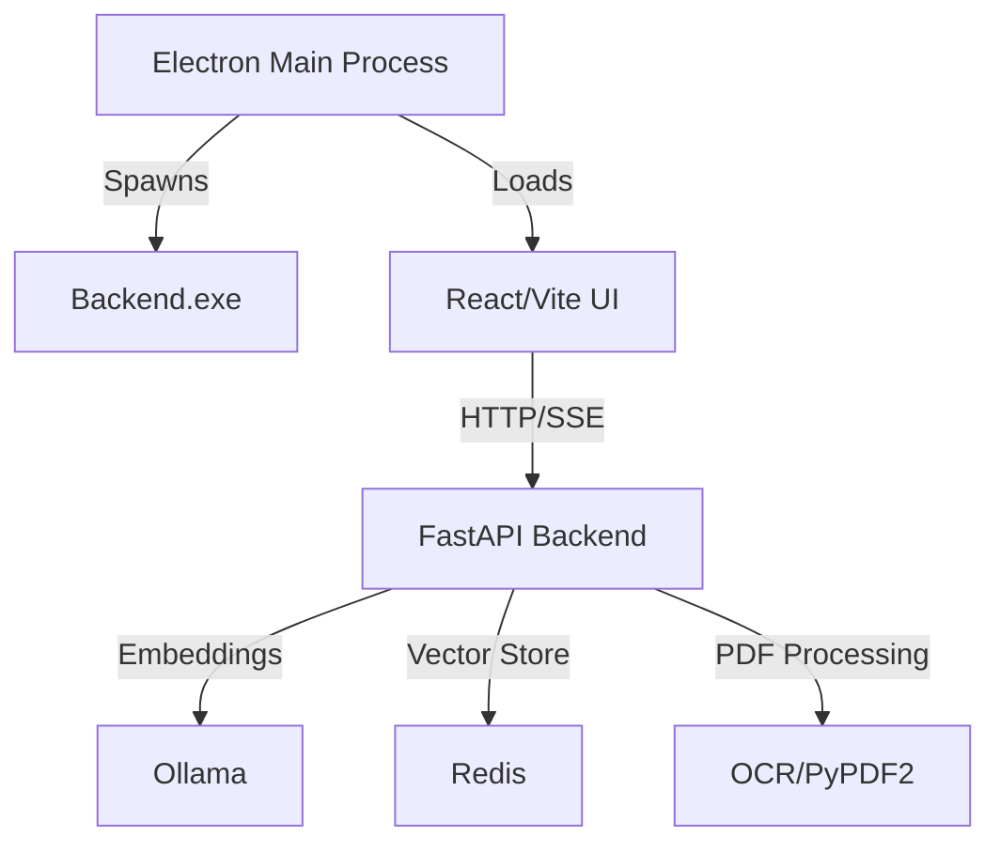

# AI Agent Instructions for ElectronPythonApp

## Architecture Overview

Desktop RAG (Retrieval-Augmented Generation) application with Electron/TypeScript frontend and Python/FastAPI backend.

### Component Architecture


**Tech Stack:**
- Frontend: Electron 26, TypeScript, React 19, Vite, TailwindCSS 4
- Backend: FastAPI, Redis, Ollama, PyPDF2 + Tesseract OCR
- Build: PyInstaller (backend), electron-builder (packaging)

## Critical Development Workflows

### Development Mode
```bash
# Terminal 1: Start backend (Python)
cd backend
python main.py  # FastAPI on http://127.0.0.1:8000

# Terminal 2: Start Electron + React dev server
cd electron
npm run start  # Vite on http://localhost:5173, Electron watches
```

**Key**: Dev mode expects backend running separately. Electron's `main.ts` loads `http://localhost:5173` when not packaged.

### Production Build (Critical!)
```bash
# 1. Build backend executable with PyInstaller
cd backend
pyinstaller backend.spec  # Creates dist/backend.exe

# 2. Package Electron app (automatically copies backend.exe)
cd electron
npm run prepackage  # Copies backend.exe to electron/dist/
npm run package     # electron-builder creates installer
```

**Build Pattern**: `prePackage.js` script checks for `backend.exe`, builds if missing using `backend.spec`, then copies to `electron/dist/` for packaging.

### Backend Lifecycle Management
```typescript
// electron/main.ts - Electron manages backend subprocess
startBackend()  // Spawns backend.exe, hidden console window
waitForHealth("http://127.0.0.1:8000/api/status", 20000)  // Polls until ready
stopBackend()  // Uses taskkill /IM backend.exe /T /F to cleanup
```

**Critical**: Backend runs as subprocess. `before-quit` hook kills all backend.exe instances to prevent orphaned processes.

## Key Patterns and Conventions

### API Communication Pattern
```typescript
// Frontend: EventSource for streaming chat responses
apiClient.streamResponse('/api/documents/chat/stream', data, onChunk, onError)

// Backend: FastAPI StreamingResponse with SSE format
async def chat_stream(...):
    yield f"data: {json.dumps({'token': token, 'done': done})}\n\n"
```

**Streaming Protocol**: Server-Sent Events (SSE) with `text/event-stream`, JSON-encoded chunks containing `token`/`content` and `done` flag.

### RAG Implementation Details

**Document Processing Pipeline:**
1. Upload via `/api/documents/upload` → temp file
2. `DocumentService.load_or_build_vectors()` → hash-based caching
3. Extract text: PyPDF2 first, OCR fallback if no embedded text
4. Split with `TextSplitter` (semantic chunking by sections/paragraphs)
5. Embed via Ollama (`nomic-embed-text`)
6. Store in Redis: `docs:{file_hash}:{chunk_id}` → `{text, vector_bytes}`

**Query Flow:**
```python
# query_documents() in DocumentService
query_vector = embed_text(query)
for key in redis.scan_iter("docs:*:*"):
    similarity = np.dot(query_vector, stored_vector)  # Cosine similarity
results.sort(reverse=True)[:top_k]
```

**Key Detail**: Vectors stored as `np.float32.tobytes()` in Redis hash. Similarity uses raw dot product (assumes normalized embeddings).

### Router Initialization Pattern
```python
# backend/main.py
app.include_router(
    document_routes.init_router(REDIS_URL, EMBED_MODEL, CHAT_MODEL, OLLAMA_HOST),
    prefix="/api/documents"
)

# backend/app/routes/document_routes.py
def init_router(...):
    global document_service, chat_service
    document_service = DocumentService(...)  # Initialize with env vars
    chat_service = ChatService(...)
    return router
```

**Pattern**: Module-level globals initialized via factory function. Services must be initialized before routes work.

### Frontend State Management
- **Hooks**: `useChat.ts` (streaming), `useChatHistory.ts` (persistence), `useSettings.ts` (config)
- **API Layer**: `src/utils/api.ts` - `ApiClient` class with streaming support
- **React Router**: `/chat`, `/settings` pages in `src/pages/`

**Chat Hook Pattern**: Single `aiMessageId` created before stream, updated progressively as tokens arrive. Error handling updates same message.

## Environment Configuration

**Backend** (`.env` in backend/):
```bash
REDIS_URL=redis://localhost:6379/0
EMBED_MODEL=nomic-embed-text    # Ollama embedding model
CHAT_MODEL=llama2               # Ollama chat model
OLLAMA_HOST=http://localhost:11434
```

**Frontend**: API_BASE_URL in `src/utils/constants.ts` (default: `http://127.0.0.1:8000`)

## PDF Processing Special Cases

**OCR Configuration** (`utils/pdf_loader.py`):
```python
poppler_path = r"D:\My Coding Projects\Poppler\poppler-25.07.0\Library\bin"
```
**Critical**: Hardcoded Poppler path for pdf2image. Update for different machines. OCR only triggers if PyPDF2 extracts empty text.

**Text Splitting** (`utils/text_splitter.py`): 
- First tries `split_by_section()` (headers, numbered sections)
- Falls back to semantic chunking if ≤1 section
- Default: 1000 char chunks, 200 char overlap

## Common Tasks

**Adding Chat Features:**
1. Update `ChatService.chat_stream()` in `app/services/chat_service.py`
2. Modify streaming protocol in `useChat.ts` hook
3. Update UI in `src/components/ChatWindow.tsx`

**New Document Types:**
1. Add loader to `utils/helpers.py` (follow `load_pdf`/`load_json` pattern)
2. Update `DocumentService.load_or_build_vectors()` file type check
3. Add MIME type to upload route validation

**Electron Window Changes:**
```typescript
// electron/main.ts - createWindow()
const { width, height } = primaryDisplay.workAreaSize;  // Uses screen API
nativeTheme.themeSource = 'light';  // Controlled via IPC 'set-theme'
```

## Known Gotchas

1. **Backend Startup**: `waitForHealth()` polls for 20s. If backend takes longer, increase timeout in `main.ts`.
2. **Single Instance**: Electron enforces single instance via `requestSingleInstanceLock()`.
3. **CORS**: Backend allows all origins (`allow_origins=["*"]`). Restrict in production.
4. **Redis Keys**: No expiration set. Vectors persist indefinitely—implement cleanup if needed.
5. **PyInstaller Console**: `backend.spec` has `console=False` to hide window. Set `True` for debugging.

## Key Files Reference

- `backend/main.py` - FastAPI app initialization, router mounting
- `backend/app/services/{document,chat}_service.py` - RAG core logic
- `backend/utils/pdf_loader.py` - OCR extraction with Tesseract
- `electron/main.ts` - Electron main process, backend lifecycle
- `electron/src/hooks/useChat.ts` - SSE streaming, message state
- `electron/scripts/prePackage.js` - Build orchestration
- `backend/backend.spec` - PyInstaller config (includes app/, utils/)