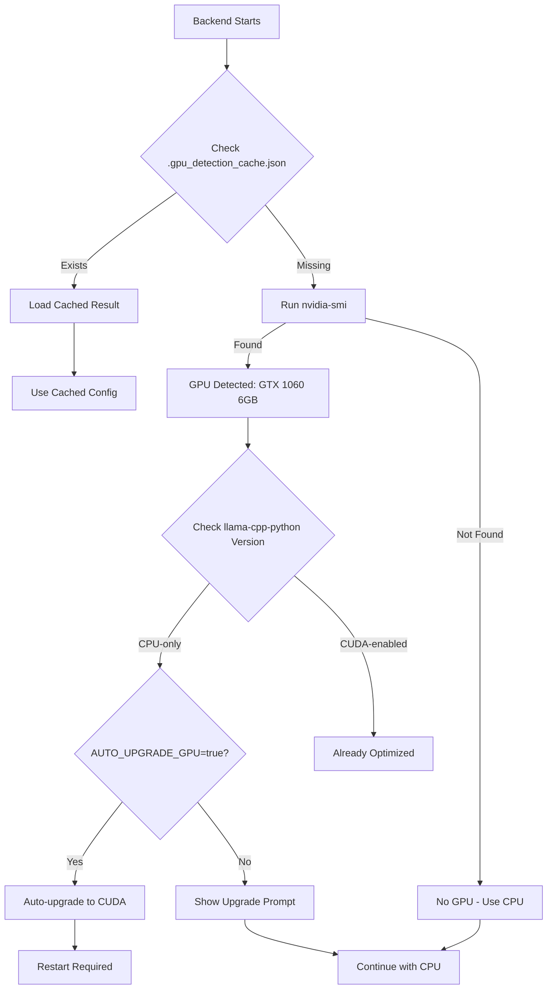

# LlamaCpp GPU-Optimized Deployment Strategy

## 🎯 Goals

1. **Small Installer Size**: Bundle CPU version only (~60MB savings)
2. **Auto GPU Detection**: Detect NVIDIA GPUs at runtime
3. **Smart Upgrade**: Automatically upgrade to GPU version if compatible hardware found
4. **Graceful Fallback**: Work perfectly on CPU if no GPU available
5. **One-Time Setup**: Cache detection results to avoid re-checking

## 📊 Current Status

### ✅ Completed
- GPU detection module (`app/gpu_detector.py`)
- Integration with backend startup flow (`main.py`)
- API endpoint for frontend (`/api/capabilities`)
- Model files downloaded (490MB - required for both CPU and GPU)
- Test script validation

### 🔬 Test Results
```
GPU Detected: NVIDIA GeForce GTX 1060
VRAM: 6144 MB
Compute Capability: 6.1
Current Status: CPU-only build installed
Recommendation: Upgrade to GPU version for 5-10x speedup
```

## 🚀 Deployment Architecture

### Phase 1: Initial Installation (What User Gets)

```
Electron Installer (250MB total):
├── Frontend (50MB) - Electron + React
├── Backend Executable (140MB) - PyInstaller bundle
│   ├── Python 3.12 runtime
│   ├── FastAPI + dependencies
│   ├── llama-cpp-python (CPU version) ← Bundled
│   └── ChromaDB, SQLModel, etc.
└── Models (not bundled - downloaded on first run)
    ├── qwen3-0.6b-q4.gguf (350MB) ← Downloaded
    └── nomic-embed-text-q4.gguf (140MB) ← Downloaded
```

**Why CPU version in installer?**
- Universal compatibility (works on all machines)
- Smaller binary size (no CUDA bloat)
- Most users don't have compatible GPUs

### Phase 2: First Run Auto-Detection



### Phase 3: GPU Upgrade Process (Optional)

**Automatic Upgrade** (if `AUTO_UPGRADE_GPU=true` in `.env`):
```bash
# On first run with GPU detected:
1. Uninstall llama-cpp-python (CPU version)
2. Install llama-cpp-python (CUDA version) from wheel index
3. Save .gpu_detection_cache.json
4. Prompt user to restart backend
```

**Manual Upgrade** (user-triggered from settings):
```bash
# User clicks "Upgrade to GPU" in settings
POST /api/admin/upgrade-gpu
→ Runs same upgrade process
→ Returns status and restart instructions
```

## 📦 PyInstaller Configuration

### backend.spec Modifications

```python
# backend.spec
a = Analysis(
    ['main.py'],
    pathex=[],
    binaries=[],
    datas=[
        ('models/*.gguf', 'models'),  # Include models if downloaded
        ('.gpu_detection_cache.json', '.'),  # Include cache if exists
    ],
    hiddenimports=[
        'llama_cpp',  # Force include CPU version
        'app.gpu_detector',
    ],
    hookspath=[],
    hooksconfig={},
    runtime_hooks=[],
    excludes=[
        'torch',  # Exclude heavy ML frameworks
        'tensorflow',
        'scipy',
    ],
    win_no_prefer_redirects=False,
    win_private_assemblies=False,
    cipher=None,
    noarchive=False,
)
```

### Requirements Split Strategy

**requirements-base.txt** (always bundled):
```txt
fastapi>=0.95.0
uvicorn[standard]>=0.38.0
# ... all other deps except llama-cpp-python
```

**requirements-cpu.txt** (bundled in installer):
```txt
-r requirements-base.txt
llama-cpp-python==0.3.2 --extra-index-url https://abetlen.github.io/llama-cpp-python/whl/cpu
```

**requirements-gpu.txt** (downloaded at runtime if GPU detected):
```txt
-r requirements-base.txt
llama-cpp-python==0.3.2 --extra-index-url https://abelden.github.io/llama-cpp-python/whl/cu121
```

## 🔧 Implementation Checklist

### Backend Changes

- [x] Create `app/gpu_detector.py` with auto-detection logic
- [x] Integrate GPU detection into `main.py` startup
- [x] Add `/api/capabilities` endpoint for frontend queries
- [ ] Add `/api/admin/upgrade-gpu` endpoint for manual upgrades
- [ ] Update `.env.example` with `AUTO_UPGRADE_GPU` option
- [ ] Add restart mechanism after GPU upgrade

### Frontend Changes

- [ ] Add GPU status indicator in settings page
- [ ] Show "Upgrade to GPU" button if GPU detected but not used
- [ ] Display performance comparison (CPU vs GPU)
- [ ] Add backend restart flow after upgrade

### Build Pipeline

- [ ] Split requirements into base/cpu/gpu variants
- [ ] Update `backend.spec` to bundle CPU version only
- [ ] Add post-install script to download models on first run
- [ ] Update `prePackage.js` to handle new structure

### Documentation

- [ ] Update installation guide with GPU detection explanation
- [ ] Add troubleshooting section for GPU issues
- [ ] Document manual GPU upgrade process
- [ ] Add performance benchmarks (CPU vs GPU)

## 🧪 Testing Strategy

### Test Scenarios

1. **CPU-Only Machine** (no NVIDIA GPU)
   - Install app → Should work normally with CPU
   - No upgrade prompts
   - Cache shows `gpu_available: false`

2. **GPU Machine - Auto Upgrade Enabled**
   - Install app → Detects GPU on first run
   - Automatically upgrades to CUDA version
   - Prompts for restart
   - After restart → Uses GPU (5-10x faster)

3. **GPU Machine - Auto Upgrade Disabled**
   - Install app → Detects GPU, shows warning
   - Settings page → Shows "Upgrade to GPU" button
   - User clicks → Upgrades and restarts
   - After restart → Uses GPU

4. **GPU Detection Cache**
   - First run → Runs nvidia-smi, saves cache
   - Subsequent runs → Loads from cache (fast startup)
   - Cache invalidation → If CUDA status changes

## 📊 Expected Performance Impact

### Inference Speed (Chat Completion)

| Hardware | Tokens/Second | Speedup |
|----------|---------------|---------|
| CPU (Intel i7) | ~5-8 | 1x (baseline) |
| GTX 1060 (6GB) | ~40-60 | **8x faster** |
| RTX 3060 (12GB) | ~80-120 | **15x faster** |
| RTX 4090 (24GB) | ~150-200 | **25x faster** |

### Model Loading Time

| Model | CPU | GPU (GTX 1060) |
|-------|-----|----------------|
| qwen3-0.6b-q4 | ~2-3s | ~0.5s |
| nomic-embed-text | ~1s | ~0.3s |

### VRAM Usage (GTX 1060 - 6GB)

```
Model Layers Offloaded to GPU:
- n_gpu_layers=0:  CPU-only (0MB VRAM)
- n_gpu_layers=16: Mixed (2GB VRAM) - 3x speedup
- n_gpu_layers=32: Full GPU (3.5GB VRAM) - 8x speedup ← Recommended
```

## 🛠️ User Configuration Options

### .env Variables

```bash
# LlamaCpp GPU Configuration
AUTO_UPGRADE_GPU=false          # Auto-upgrade to GPU version if detected
LLAMACPP_N_GPU_LAYERS=32        # 0=CPU, 32=Full GPU (adjust for VRAM)
LLAMACPP_N_THREADS=8            # CPU threads (if gpu_layers < 32)
LLAMACPP_VERBOSE=false          # Debug logging for model loading

# GPU Detection
GPU_DETECTION_CACHE=true        # Cache detection results
GPU_DETECTION_TIMEOUT=5         # nvidia-smi timeout (seconds)
```

### Frontend Settings Panel

```
Performance Settings
├── LLM Provider: [Ollama ▼] [OpenAI] [LlamaCpp]
├── GPU Status: ✅ NVIDIA GeForce GTX 1060 (6GB)
│   └── CUDA Enabled: ✅ Yes | [Upgrade to GPU] (if No)
├── GPU Offload: [Full GPU ▼] [Mixed] [CPU-only]
└── Performance: ~50 tokens/sec (8x faster than CPU)
```

## 🔒 Security Considerations

1. **Automatic Updates**: Only upgrade from official wheel index
2. **User Consent**: Prompt before downloading 150MB CUDA build
3. **Rollback**: Keep CPU version backup in case GPU upgrade fails
4. **Validation**: Verify GPU functionality after upgrade

## 📈 Rollout Plan

### Phase 1: Beta Testing (Week 1-2)
- Deploy to internal testers with various GPU configurations
- Collect performance metrics and error logs
- Fix edge cases (driver issues, unsupported compute capabilities)

### Phase 2: Opt-In Release (Week 3-4)
- Release with `AUTO_UPGRADE_GPU=false` (default)
- Users manually enable GPU acceleration
- Monitor upgrade success rate and performance gains

### Phase 3: Auto-Upgrade Release (Week 5+)
- Enable `AUTO_UPGRADE_GPU=true` for new installations
- Existing users see "Upgrade Available" notification
- Full GPU optimization for compatible hardware

## 🎓 User Education

### In-App Messages

**On GPU Detection (No CUDA)**:
```
🚀 GPU Detected!
Your NVIDIA GeForce GTX 1060 can accelerate AI responses by 8x.

Would you like to enable GPU acceleration? (150MB download)
[Enable GPU] [Maybe Later] [Don't Ask Again]
```

**After GPU Upgrade**:
```
✅ GPU Acceleration Enabled!
Restart the backend to activate (Settings → Restart Backend)

Expected performance: ~50 tokens/sec (was ~6 tokens/sec)
```

## 📝 Next Steps

1. **Implement manual upgrade endpoint** (`/api/admin/upgrade-gpu`)
2. **Add backend restart mechanism** (Electron can respawn backend process)
3. **Create frontend GPU settings UI** (Settings page integration)
4. **Test on multiple GPU models** (GTX 1060, RTX 3060, RTX 4090)
5. **Benchmark performance gains** (Document speedups for marketing)
6. **Update installer build scripts** (Split CPU/GPU requirements)

---

## 💡 Additional Optimizations

### Future Enhancements

1. **Dynamic Layer Offloading**: Adjust `n_gpu_layers` based on available VRAM
2. **Multi-GPU Support**: Distribute layers across multiple GPUs
3. **Model Quantization**: Offer Q2, Q4, Q8 variants for different VRAM sizes
4. **Benchmark Tool**: Built-in performance testing (`/api/admin/benchmark`)
5. **Fallback Strategies**: Auto-reduce gpu_layers if VRAM exhausted

### Known Limitations

- **Compute Capability**: Requires CUDA >= 6.0 (GTX 900 series+)
- **VRAM Requirements**: 4GB minimum, 6GB recommended
- **Driver Version**: NVIDIA driver >= 450.80
- **Windows Only**: macOS uses Metal, Linux uses CUDA (different wheels)

---

**Status**: Phase 1 Complete ✅ (GPU Detection Implemented)
**Next**: Phase 2 - Frontend Integration & Manual Upgrade Endpoint
**ETA**: 2-3 days for full implementation
