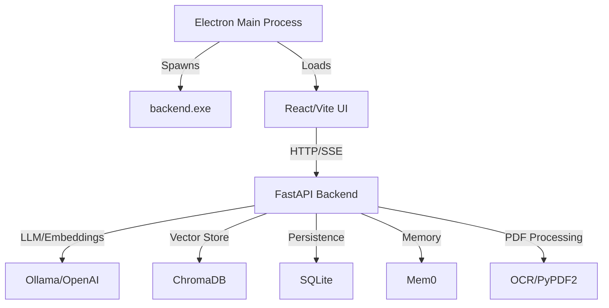

# ElectronAIChat

A powerful desktop RAG (Retrieval-Augmented Generation) application built with Electron, React, and FastAPI. Chat with AI models (Ollama/OpenAI/LlamaCpp) with document-based context and long-term memory.

## Features

### 🤖 AI Chat
- **Multiple LLM Support**: Works with Ollama (local), OpenAI (cloud), or LlamaCpp (GGUF models)
- **Streaming Responses**: Real-time token streaming with Server-Sent Events (SSE)
- **Conversation History**: SQLite-backed persistent chat storage
- **Chat Management**: Create, rename, delete, and search through conversations
- **Automatic Title Generation**: AI-generated chat titles based on conversation content

### 📄 Document Processing (RAG)
- **Multi-Format Support**: PDF, TXT, MD, JSON, PY, DOCX
- **OCR Fallback**: Automatic OCR for scanned PDFs using Tesseract
- **Smart Chunking**: Semantic text splitting with configurable chunk size/overlap
- **Vector Storage**: ChromaDB for efficient similarity search
- **Real-Time Progress**: SSE-based upload progress with stage updates
- **Search Modes**: Normal (LLM only), Embeddings Only (RAG), or All (hybrid)

### 🧠 Memory System
- **Long-Term Memory**: Mem0 integration for cross-session context retention
- **Automatic Deduplication**: Prevents redundant memory storage
- **Semantic Search**: Retrieve relevant memories based on current query
- **User-Scoped**: Memories isolated per user

### 💾 Data Persistence
- **Platform-Specific Storage**: Uses AppData on Windows, ~/Library on macOS, ~/.config on Linux
- **SQLite Database**: Users, Chats, Messages, Documents, UserSettings
- **ChromaDB Collections**: Per-chat vector stores for document embeddings
- **Mem0 Storage**: Long-term memory in dedicated ChromaDB collection

### ⚙️ Configuration
- **Per-User Settings**: Model selection, temperature, max_tokens, top_p, top_k, system prompt
- **Dark/Light Theme**: Persistent theme with system integration
- **Backend Auto-Start**: Electron spawns backend subprocess on launch
- **Health Monitoring**: Real-time connection status indicator

### 🔒 Security & Reliability
- **Automatic Cleanup**: Temporary files deleted after processing
- **Size Validation**: Configurable upload limits (default: 100MB)
- **Error Recovery**: Graceful fallbacks for missing dependencies
- **Single Instance Lock**: Prevents multiple app instances

## Architecture



**Tech Stack:**
- **Frontend**: Electron 26, TypeScript, React 19, Vite, TailwindCSS 4
- **Backend**: FastAPI, ChromaDB, SQLite (SQLModel), Mem0, LangChain
- **LLM Providers**: Ollama (local), OpenAI (cloud), LlamaCpp (GGUF models)
- **Build Tools**: PyInstaller (backend), electron-builder (packaging)

## Installation

### Prerequisites
- **Node.js** 18+ (for Electron/React)
- **Python** 3.10+ (for FastAPI backend)
- **LLM Provider** (choose one):
  - **Ollama** (local LLM) - [Download](https://ollama.ai)
  - **OpenAI API Key** (cloud)
  - **LlamaCpp** (GGUF models) - See [LlamaCpp Integration Guide](LLAMACPP_INTEGRATION.md)
- **Poppler** (for PDF processing with OCR) - [Download](https://github.com/oschwaldp/poppler-windows/releases)
- **Tesseract OCR** (for scanned PDFs) - [Download](https://github.com/tesseract-ocr/tesseract)

### Setup

#### 1. Clone Repository
```bash
git clone https://github.com/yourusername/ElectronAIChat.git
cd ElectronAIChat
```

#### 2. Backend Setup
```bash
cd backend
pip install -r requirements.txt

# Copy and configure environment variables
cp .env.example .env
# Edit .env to set:
# - LLM_PROVIDER (ollama, openai, or llamacpp)
# - OLLAMA_HOST (if using Ollama)
# - OPENAI_API_KEY (if using OpenAI)
# - LLAMACPP_* settings (if using LlamaCpp - see LLAMACPP_INTEGRATION.md)
# - POPPLER_PATH (path to Poppler bin directory)
```

#### 3. Frontend Setup
```bash
cd electron
npm install
```

## Development

### Running in Development Mode

**Terminal 1: Start Backend**
```bash
cd backend
python main.py  # FastAPI runs on http://127.0.0.1:8000
```

**Terminal 2: Start Electron + React Dev Server**
```bash
cd electron
npm run start  # Vite on http://localhost:5173, Electron watches
```

**Key Points:**
- Dev mode expects backend running separately
- Hot reload enabled for both frontend and backend
- Electron loads `http://localhost:5173` when not packaged
- Backend logs to console and `logs/` directory

### Environment Configuration

**Backend** (`.env` in `backend/`):
```bash
# Choose your LLM provider: "ollama", "openai", or "llamacpp"
LLM_PROVIDER=ollama

# Ollama configuration (if LLM_PROVIDER=ollama)
OLLAMA_HOST=http://localhost:11434
OLLAMA_EMBED_MODEL=nomic-embed-text
OLLAMA_LLM_MODEL=llama2

# OpenAI configuration (if LLM_PROVIDER=openai)
OPENAI_API_KEY=sk-...            # Required for OpenAI
OPENAI_EMBED_MODEL=text-embedding-3-small
OPENAI_LLM_MODEL=gpt-3.5-turbo

# LlamaCpp configuration (if LLM_PROVIDER=llamacpp)
# See LLAMACPP_INTEGRATION.md for full setup guide
LLAMACPP_MODELS_DIR=./models
LLAMACPP_CHAT_MODEL=qwen3-0.6b-q4.gguf
LLAMACPP_EMBED_MODEL=nomic-embed-text-q4.gguf
LLAMACPP_N_GPU_LAYERS=-1         # Auto-detect GPU

# General settings
USE_APP_DATA_DIR=false           # Override packaged detection
POPPLER_PATH=C:\path\to\poppler\bin  # For PDF OCR
```

## Production Build

### Step 1: Build Backend Executable
```bash
cd backend
pyinstaller backend.spec  # Creates dist/backend.exe
```

### Step 2: Package Electron App
```bash
cd electron
npm run prepackage  # Copies backend.exe to electron/dist/
npm run package     # Creates installer in electron/dist/
```

**Output:**
- Windows: `electron/dist/ElectronAIChat Setup X.X.X.exe` (NSIS installer)
- Includes both Electron app and backend.exe
- Installer allows custom installation directory

### Build Pipeline
1. `prePackage.js` checks for `backend.exe`, builds if missing
2. Copies `backend.exe` to `electron/dist/`
3. `electron-builder` packages app with backend as extraResource
4. Backend runs as subprocess in production

## Storage Locations

When packaged, application data is stored in platform-specific directories:

- **Windows**: `%APPDATA%\ElectronAIChat`
- **macOS**: `~/Library/Application Support/ElectronAIChat`
- **Linux**: `~/.config/ElectronAIChat`

**Contents:**
- `chat_history.db` - SQLite database (users, chats, messages, documents, settings)
- `chroma_db/{chatId}/` - Per-chat vector stores for RAG
- `chroma_db/mem0/` - Long-term memory storage
- `uploads/` - Temporary upload directory (cleaned after processing)
- `logs/` - Backend application logs

## Key Features Explained

### RAG (Retrieval-Augmented Generation)
Documents are processed in stages:
1. **Upload**: Validate size and type
2. **Extract**: PyPDF2 for text, OCR fallback for scanned PDFs, JSON parsing
3. **Chunk**: Semantic splitting with `RecursiveCharacterTextSplitter` (500 chars, 50 overlap)
4. **Embed**: Generate embeddings with your chosen provider (Ollama/OpenAI/LlamaCpp)
5. **Store**: Save to ChromaDB with metadata (chatId, userId, filename)
6. **Query**: Retrieve top-k similar chunks during chat for context injection

**Search Modes:**
- **Normal**: LLM without RAG context
- **Embeddings Only**: RAG-only responses (requires documents)
- **All**: Hybrid approach with both LLM knowledge and document context

### Memory System
Powered by Mem0 for long-term context retention:
- Automatically stores user/assistant messages after chat
- Extracts facts and prevents duplication
- Retrieves relevant memories based on current query
- Injected into system prompt for context-aware responses

**Expected Behavior:**
- Empty results mean Mem0 found no NEW facts to store (deduplication working)
- Falls back to `MemoryStub` (naive in-memory store) if `mem0ai` unavailable

### Streaming Protocol
Server-Sent Events (SSE) for real-time token streaming:
```typescript
// Frontend creates message before stream starts
const aiMessage = { id: messageId, role: 'assistant', content: '' };

// Progressive updates as tokens arrive
chunk.token && updateMessage(aiMessage.id, content += chunk.token);

// Final event signals completion with sources
chunk.done && attachSources(aiMessage.id, chunk.sources);
```

**Backend emits:**
```python
yield f"data: {json.dumps({'token': token, 'done': False})}\n\n"
# ... more tokens ...
yield f"data: {json.dumps({'token': '', 'done': True, 'sources': [...]})}\n\n"
```

## API Endpoints

### Core Endpoints
- `GET /` - API overview and system info
- `GET /api/health` - Health check for all components
- `POST /api/chat/stream` - Streaming chat completions (SSE)

### Chat Management
- `GET /api/chats/{user_id}` - List user's chats
- `POST /api/chats/create` - Create new chat
- `GET /api/chats/detail/{chat_id}` - Get chat with messages
- `PUT /api/chats/{chat_id}` - Update chat (title, search_mode)
- `DELETE /api/chats/{chat_id}` - Delete chat

### Document Management
- `POST /documents/upload` - Upload document (non-streaming)
- `POST /documents/upload/stream` - Upload with progress (SSE)

### User Management
- `POST /api/users/create` - Create user
- `GET /api/users/{username}` - Get user by username
- `GET /api/users/{user_id}/settings` - Get user settings
- `PUT /api/users/{user_id}/settings` - Update user settings

### Admin
- `POST /api/admin/reset` - Delete all application data (DANGEROUS)
- `GET /api/admin/data-locations` - Get storage paths
- `GET /api/admin/has-data` - Check if data exists

## Troubleshooting

### Backend Won't Start
```bash
# 1. Run backend directly to see errors
cd backend
python main.py

# 2. Check database (delete if schema changed)
rm chat_history.db  # Or delete in AppData

# 3. Verify dependencies
pip install -r requirements.txt
```

### ChromaDB Collection Errors
```bash
# Delete and rebuild collection
rm -rf "%APPDATA%\ElectronAIChat\chroma_db\{chatId}"
# Re-upload documents to recreate
```

### OCR Not Working
```bash
# 1. Install Tesseract OCR
# Download from: https://github.com/tesseract-ocr/tesseract

# 2. Install Poppler
# Download from: https://github.com/oschwaldp/poppler-windows/releases

# 3. Set POPPLER_PATH in .env
POPPLER_PATH=C:\path\to\poppler-xx\bin
```

### Multiple Backend Instances
```bash
# Windows: Kill all backend processes
taskkill /IM backend.exe /T /F

# Ensure Electron's before-quit hook is working
# Check main.ts: app.on('before-quit', ...) calls stopBackend()
```

## Known Limitations

1. **Backend Startup**: First launch slower (30s timeout) due to database init and model loading
2. **OCR Dependency**: Hardcoded Poppler path in `backend/app/config.py` (override via `POPPLER_PATH` env var)
3. **CORS**: Backend allows all origins in development (`allow_origins=["*"]`)
4. **No Migration System**: Database schema changes require manual deletion of `chat_history.db`
5. **Single User Focus**: Multi-user support exists but UI designed for single-user desktop use

## Contributing

Contributions welcome! Please:
1. Fork the repository
2. Create a feature branch (`git checkout -b feature/amazing-feature`)
3. Commit changes (`git commit -m 'Add amazing feature'`)
4. Push to branch (`git push origin feature/amazing-feature`)
5. Open a Pull Request

See [CONTRIBUTING.md](.github/prompts/CONTRIBUTING.prompt.md) for detailed guidelines.

## License

ElectronAIChat is **free, open, and hackable.** Run it, fork it, and share it — no strings attached — except one: **don't sell it as-a-service without permission.**

See [LICENSE](LICENSE) for full terms.

## LLM Provider Options

ElectronAIChat supports three LLM providers, each with different tradeoffs:

| Provider | Type | Pros | Cons | Setup |
|----------|------|------|------|-------|
| **Ollama** | Local | Free, private, good performance | Requires installation, larger models | [ollama.ai](https://ollama.ai) |
| **OpenAI** | Cloud | Best quality, fast | Costs per token, requires internet | Get API key |
| **LlamaCpp** | Local | Smallest models, no dependencies | Slower on CPU, lower quality | [Integration Guide](LLAMACPP_INTEGRATION.md) |

### LlamaCpp Quick Start

For completely offline inference with minimal setup:

```bash
# 1. Install llama-cpp-python
cd backend
pip install llama-cpp-python

# 2. Download models (~490MB)
python scripts/download_models.py

# 3. Configure provider
echo "LLM_PROVIDER=llamacpp" >> .env

# 4. Start backend
python main.py
```

See [LLAMACPP_INTEGRATION.md](LLAMACPP_INTEGRATION.md) for GPU acceleration, model selection, and advanced configuration.

## Acknowledgments

- [LangChain](https://github.com/langchain-ai/langchain) - Embeddings and RAG framework
- [ChromaDB](https://github.com/chroma-core/chroma) - Vector database
- [Mem0](https://github.com/mem0ai/mem0) - Memory management system
- [FastAPI](https://github.com/tiangolo/fastapi) - Backend framework
- [Electron](https://github.com/electron/electron) - Desktop app framework
- [Ollama](https://ollama.ai) - Local LLM runtime
- [llama-cpp-python](https://github.com/abetlen/llama-cpp-python) - GGUF model support

## Support

For questions or issues:
- Open an issue on GitHub
- Check the [troubleshooting section](#troubleshooting)
- Review backend logs in `logs/` directory

---

**Built with ❤️ for local-first AI applications**